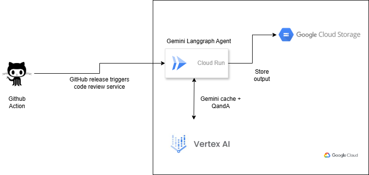
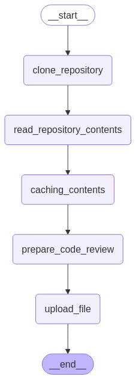
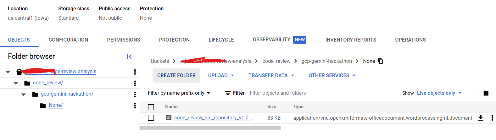

# 🚀 Automated Code Review Workflow with Gemini and LangGraph

## ⚡ Overview

This document outlines the architecture and workflow for an automated code review system that leverages Gemini, LangGraph, Cloud Run, and Google Cloud Storage. The system is triggered by new releases in GitHub or GitLab repositories, automatically reviews the codebase, and stores the review results in a Google Cloud Storage bucket.

## 🔂  Architecture



The diagram illustrates the following components:

*   **GitHub/GitLab Action:** A GitHub Action or GitLab CI/CD pipeline that triggers the code review service upon a new release.
*   **Cloud Run:** A managed compute platform that hosts the Gemini LangGraph Agent. It receives the repository details (name, organization, release name) from the trigger.
*   **Gemini LangGraph Agent:** The core of the system, built using LangGraph. It orchestrates the code review process using Vertex AI.
*   **Vertex AI:** This is where the Gemini model resides. It is used for question answering and content generation during the code review process. It also makes use of Gemini caching service.
*   **Google Cloud Storage (GCS):** A scalable storage service for storing the generated code review documents.

## 🔧 Functional Flow (LangGraph)



# 🤖 The LangGraph workflow consists of the following nodes:

1.  **\_\_start\_\_:** The entry point of the workflow.
2.  **clone\_repository:** Clones the specified repository from GitHub or GitLab using the provided repository name and organization details.
3.  **read\_repository\_contents:** Reads the entire codebase from the cloned repository and formats it into a single string. Each file's content is encapsulated within `<file> </file>` tags, with the filename preceding the content.

    ```
    <file>path/to/file1.py</file>
    # Content of file1.py
    ...
    <file>path/to/file2.js</file>
    // Content of file2.js
    ...
    ```

4.  **caching\_contents:** Caches the formatted codebase string using Gemini's caching mechanism for faster retrieval during the code review process.
5.  **prepare\_code\_review:** This node orchestrates the code review process itself:

    *   Reads a `questionnaire.json` file containing a list of code review questions.
    *   For each question:
        *   Queries the cached codebase content using Vertex AI and Gemini to get an answer.
        *   Documents the question and its corresponding answer in a `.docx` file.
6.  **upload\_file:** Uploads the generated `.docx` file to a designated Google Cloud Storage bucket. The filename follows the format: `code_review_{repository_name}_v{release_version}_{date}.docx` (e.g., `code_review_api_repository_v1.0.0_2025-03-17.docx`).
7.  **\_\_end\_\_:** The exit point of the workflow.

# Technical details

 - The service is deployed in cloud run
 - It is using fastapi
 - It is using Gemini 1.5 Pro 002 model
 - It uses Gemini context caching


# 🛠️ Deployment

 - It is using Terraform infrastructure as code available [here](iac/deploy-cloudrun/)
 - It deploys the cloud run service, along with service account.
 - It refers the github credentials from the secret manager and mounts in the environment variable.
 

## Workload identity federation

 - It uses workload identity federation for github to have keyless authentication.
 - This configuration was done for this repository and the example repository which is code reviewed by this process.
 - Entire workload identity setup is available [here](workload-identity-github/workload-init.sh)

## 🛠️ Cloud run environment variables:

 - user="arindam-b"
 - PAT="Github PAT"
 - local_directory="/tmp"
 - org_name="arindam-b"
 - project_id="MY-GCP-PROJECT-ID"
 - location="us-central1"
 - model_id="gemini-1.5-pro-002"
 - gcs_bucket="MY-GCP-BUCKET"


**🛠️ Environment variables**

The following environment variables are for reference only, in case one has to run it locally.

**Note**: the PAT of github is stored as an environment variable.
In a cloud run service it was mounted 
from a secret manager's latest secret version.


**Dependencies**: [requirements.txt](requirements.txt)

## 📚 Input

The Cloud Run service expects the following input parameters:

*   `repository_name`: The name of the repository (e.g., `api_repository`).
*   `org_name`: The GitHub organization name or GitLab group name.
*   `release_name`: The name of the release tag (e.g., `v1.0.0`).

These parameters are passed in the request body or as query parameters to the Cloud Run service.

## Questionnaire File (`questionnaire.json`)

The [`questionnaire.json`](source/questionnaires.json) file contains a list of questions used for the code review. As this is demo repository, in production grade project, this should be stored in a GCS bucket.

Here's an example:

```json
{
    "coding_best_practices" : [
        "The codebase following the best practices of the language? if no, what is your observations.",
        ...
    
        \\ 

        ...
```

## 📚 Execution Process

A sample repository called: "api_repository" triggered this workflow and the agent generated this output file which is mentioned in the **Sample output** section down below.


Input payload for the langgraph rest api:

```
GET Request:

/{org_name}/{repository_name}/{release_name}

# org_name : arindam-b
# repository_name: api_repository
# release_name: v1.0.0

```

# ⚡Sample output

The same output is stored is available here [The Output document](output/code_review_api_repository_v1.0.0_2025-3-17.docx) for your review.





## ⚡ Get Started in 5 Minute in Local environment

Ready to build your AI agent for code review? Simply run this command:

```bash
# Create and activate a Python virtual environment
python -m venv venv && source venv/bin/activate

# Install dependencies
pip install -r requirements.txt
```


Following environment variables to set:

```bash
export user="your git user"
export PAT="Github PAT"
export local_directory="/tmp"
export org_name="your org name or your git user for a private repository"
export project_id="MY-GCP-PROJECT-ID"
export location="us-central1"
export model_id="gemini-1.5-pro-002"
export gcs_bucket="MY-GCP-BUCKET"
```

Then access the url:

GET request: http://localhost:8080//{org_name}/{repository_name}/{release_name}


org_name: github org name or your personal user id
repository_name: your git repository name only
release_name: git release name


## Presentation

The full presentation is available [here](presentation/Google-Agentic-Hackathon.pptx)


## Note to the reviewer

 - The entire agent was built using langchain langgraph eco-system and provisioned
   via terraform service.
 - Due to the time constraint, terraform provisioning was not done in github action workflow. So this agentic service in cloud run provisioned by manual terraform code execution.
 - If I would like to review another code base via this solution, my any other repository needs to trigger the cloud run service from it's github action workflow,
 when a new tag is created


