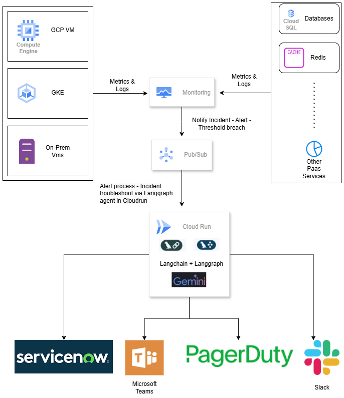
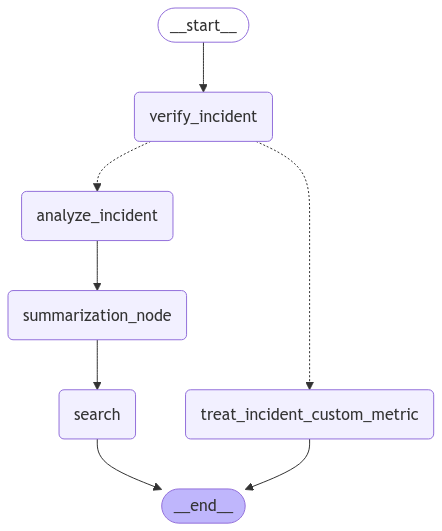

# Automating Incident Triage with Gemini and Langgraph

**Overview**

This repository contains the source code and infrastructure deployment files for an incident triage solution that leverages the power of Google Vertex AI, Gemini 1.5 Pro, and the Langgraph framework. The solution automates the initial triage process by analyzing incidents, suggesting potential root causes, and recommending short-term and long-term solutions.

**Architecture**

The architecture consists of the following components:

 - Monitoring & Logging: Monitoring tools (e.g., Prometheus, Stackdriver) collect metrics and logs from various infrastructure components (VMs, containers, databases).
 - Alerting: Alerting policies are defined based on critical metrics. When thresholds are breached, alerts are triggered.
 - Pub/Sub: A pub/sub system (e.g., Kafka, Google Pub/Sub) is used to distribute incident alerts to the triage agent.
 - Triage Agent: Deployed on Google Cloud Run, the agent is powered by Gemini 1.5 Pro and the Langgraph framework. It performs the following tasks:
 - Incident Analysis: Analyzes the incident data, identifies potential root causes, and generates initial solutions.
 - Knowledge-Driven Analysis: Leverages Gemini's knowledge base and reasoning capabilities to suggest solutions.
 - Summarization: Summarizes the incident in a concise phrase.
 - Internet Search: Uses the Tavily API (or Google Search) to search for relevant articles, blog posts, and troubleshooting guides. Search is done via Summarized phrases from previous steps.
 - Notification: Notifies relevant teams (e.g., via Microsoft Teams, ServiceNow, PagerDuty) with the analysis, solutions, and internet search results.

**Langgraph workflow**

Collaboration: The solution facilitates collaboration among engineers by providing a central platform for incident information and analysis.

**Deployment**

The solution is deployed using Terraform, which automates the provisioning of infrastructure resources on Google Cloud Platform. It
deploys Cloud run service.

**Tavily API Key**

Please ensure to add Tavily API key in the **env** section of the
[file](iac/cloudrun.tf). For the simplicity of the usecase, this
is put as the environment variable, but for the security reason,
it has to be put in the secret manager. To focus on the agentic
solution this is kept as a plain text.

The Tavily API key can be found in the site by creating an account.

**Usage**

 - Configure Monitoring & Alerting: Set up monitoring tools and define alert policies based on your specific requirements.
 - Deploy Infrastructure: Use Terraform to deploy the necessary infrastructure components, including the Cloud Run service for the triage agent.
 - Configure Agent: Configure the agent with the necessary credentials and parameters, such as API keys for the Tavily API or Google Search.
 - Test and Validate: Test the solution with simulated incidents to ensure it functions as expected.
 - Monitor and Maintain: Regularly monitor the agent's performance and make necessary adjustments.

**Customization**

 - Integrations: Integrate with other tools and platforms (e.g., SIEM systems, ITSM tools) to enhance the solution's capabilities.
 - Custom Models: Train custom Gemini models for specific incident types or environments.
 - Alerting Logic: Refine alerting logic to reduce noise and improve the accuracy of incident detection.
Feedback

We welcome your feedback on this solution. Please feel free to submit issues or pull requests to improve the code, documentation, and overall functionality.
